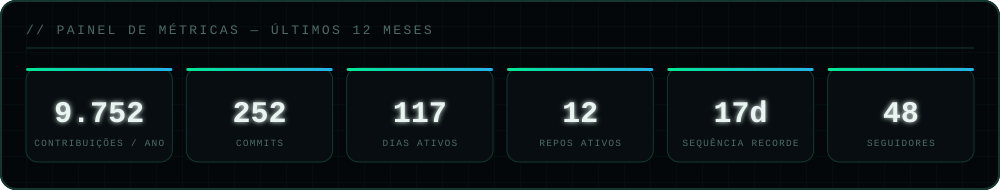

<!--
  Perfil de V4SP3R (Geovane Santos)
  Os cards em ./assets/{kpi,langs,contrib}.svg E o bloco entre os marcadores
  METRICS:START / METRICS:END sao gerados automaticamente por
  .github/workflows/profile.yml -> scripts/build-cards.mjs.
  Nao edite esses tres SVGs nem aquele paragrafo na mao: sao sobrescritos
  a cada 6 horas com os numeros lidos do calendario publico de contribuicoes.
-->

<div align="center">



<br/>

<a href="https://www.linkedin.com/in/geovanesantoxx"></a>
<a href="https://github.com/V4SP3R"></a>
<a href="https://github.com/V4SP3R?tab=followers"></a>
<a href="https://github.com/V4SP3R"></a>


</div>

## `01` — whoami

```console
v4sp3r@github:~$ whoami --verbose

  nome        Geovane dos Santos Silva
  alias       V4SP3R
  papel       Desenvolvedor Full-Stack  ·  Automação  ·  Dados
  base        Brasil  ·  UTC-3
  times       @HPG-CODES   @VanStop-web
  formação    Programação de Soluções Computacionais — UNA

v4sp3r@github:~$ cat foco-atual.txt

  ▸ Dashboards de dados e painéis de gestão (leads, visitantes, KPIs)
  ▸ Integrações de API e rastreamento de conversões
  ▸ Front-end responsivo em HTML · CSS · JavaScript
  ▸ Back-end e lógica de negócio em Java (POO) e Python
  ▸ Ferramentas de IA aplicadas ao fluxo de desenvolvimento

v4sp3r@github:~$ _
```

<div align="center"></div>

## `02` — stack

<div align="center">


<br/><br/>


<br/>

<p><code>Java (POO)</code> · <code>Python</code> · <code>JavaScript</code> · <code>TypeScript</code> · <code>HTML5</code> · <code>CSS3</code> · <code>Git</code> · <code>APIs REST</code> · <code>GitHub Actions</code></p>

<sub>para incluir novas techs, basta acrescentar o slug em <code>skillicons.dev/icons?i=...</code></sub>

</div>

<div align="center"></div>

## `03` — métricas

<!-- METRICS:START -->
<div align="center">



<br/>



</div>

> **Leitura do painel** — são **9.729 contribuições nos últimos 12 meses**, distribuídas em
> **112 dias com código**, com sequência recorde de **17 dias** e pico de **1.636 contribuições
> em um único dia**. O mês mais forte foi **julho de 2026**, com **7.380 contribuições**; nos
> últimos 30 dias foram **47 contribuições em 7 dias ativos**. Desse volume, **242 commits
> diretos** em **10 repositórios** são os que a API pública detalha.
>
> <sub>números lidos do calendário público de contribuições e regenerados a cada 6 horas — última atualização: 03/09/2026</sub>
<!-- METRICS:END -->

<div align="center"></div>

## `04` — linguagens

<!-- LANGS:START -->
<div align="center">



</div>
<!-- LANGS:END -->

<div align="center"></div>

## `05` — o que eu construo

| | Projeto | Stack | Sobre |
|:--:|:--|:--|:--|
| 🎨 | **[Colorfy](https://github.com/V4SP3R/Colorfy)** | `HTML` `CSS` `JS` | Ferramenta visual de paletas e exploração de cores. |
| ✍️ | **[ZapAssina](https://github.com/V4SP3R/ZapAssina)** | `HTML` `JS` | Gerador de assinaturas para comunicação e atendimento. |
| 📜 | **[Assinatura e Certificado](https://github.com/V4SP3R/Assinatura-e-certificado)** | `HTML` `JS` | Emissão automatizada de certificados e assinaturas. |
| ➗ | **[Matemática Computacional](https://github.com/V4SP3R/Estudo-interativo-para-Matem-tica-Computacional-Aplicada)** | `HTML` `JS` | Material de estudo interativo com visualizações. |
| 🌸 | **[Dia das Mulheres](https://github.com/V4SP3R/dia-das-mulheres)** | `HTML` `CSS` | Landing page temática com foco em animação e layout. |
| 🎯 | **[Página de Cores](https://github.com/V4SP3R/pagina-de-cores)** | `HTML` `CSS` | Experimento de design system e teoria das cores. |

<table>
<tr>
<td width="33%" valign="top">
<h3>🟩 Produto &amp; Dados</h3>
<p>Painéis de gestão em produção pela <b>@HPG-CODES</b>: <code>dashboard-visitantes</code>,
<code>dashboard-leads</code>, <code>dash</code> e o <code>HUB-HPG</code> — visualização de
leads, tráfego e KPIs para times comerciais.</p>
</td>
<td width="33%" valign="top">
<h3>🟦 Web &amp; Front-end</h3>
<p>Interfaces autorais em HTML/CSS/JS: <b>Colorfy</b> (paletas e cores), <b>ZapAssina</b> e
<b>Assinatura-e-certificado</b> (geração de assinaturas e certificados), além de landing
pages temáticas.</p>
</td>
<td width="33%" valign="top">
<h3>🟪 Integrações &amp; IA</h3>
<p><code>pinterest-conversions-api</code> para rastreamento de conversões, e estudo ativo de
ferramentas de IA para engenharia — <b>claude-mem</b>, <b>ECC</b> e o diretório oficial de
plugins do Claude Code.</p>
</td>
</tr>
</table>

### 🎓 Base acadêmica sólida

Mais de **12 repositórios** de exercícios em **Java** (`psc-lista-01` → `psc-lista-12`,
POO, calculadora, conta bancária) — fundamento em algoritmos, orientação a objetos e
estruturas de dados construído de forma pública e versionada, exercício por exercício.

<div align="center"></div>

## `06` — atividade

<div align="center">

<sub>a cobrinha percorre o gráfico de contribuições real, regenerado a cada 6 horas por GitHub Actions</sub>

<br/>

<picture>
  <source media="(prefers-color-scheme: dark)"  srcset="https://raw.githubusercontent.com/V4SP3R/V4SP3R/output/snake-dark.svg" />
  <source media="(prefers-color-scheme: light)" srcset="https://raw.githubusercontent.com/V4SP3R/V4SP3R/output/snake.svg" />
  
</picture>

</div>

<div align="center"></div>

## `07` — contato

```console
v4sp3r@github:~$ ./contato --open
  ▸ aberto a colaborações, freelas e oportunidades full-stack
```

<div align="center">

<a href="https://www.linkedin.com/in/geovanesantoxx">
  
</a>
<a href="https://github.com/V4SP3R?tab=repositories">
  
</a>

<br/>


<sub>`> exit 0` — obrigado por passar por aqui.</sub>

</div>
